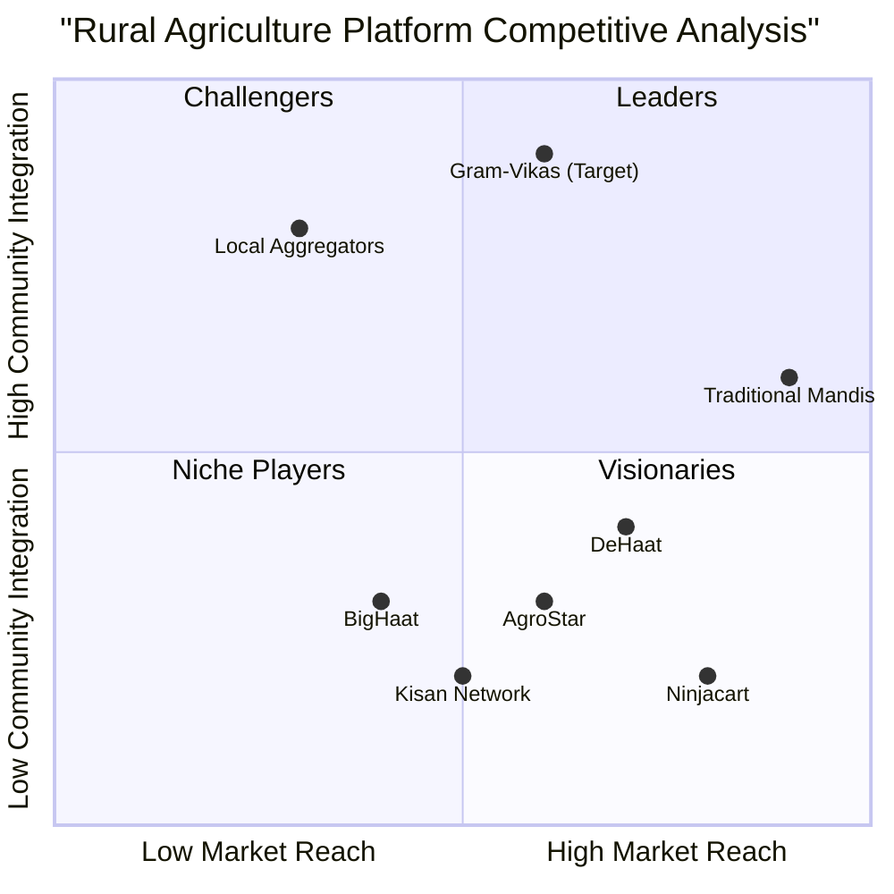

# Gram-Vikas: Unified Rural Economic Engine - Product Requirements Document (PRD)

## 1. Language & Project Information

**Language:** English  
**Programming Language:** TypeScript, Node.js, React Native, Next.js, Tailwind CSS  
**Project Name:** gram_vikas_platform  
**Team:** DECIPHER  

### Original Requirements Restatement
Transform the existing basic village development system into a comprehensive unified rural economic engine that integrates digital marketplace, aggregation hubs, logistics, finance, and community governance to connect smallholder farmers with broader markets while ensuring digital inclusion through multi-channel access (smartphones and feature phones).

## 2. Product Definition

### 2.1 Product Goals

1. **Market Integration Goal**: Connect 100,000+ smallholder farmers to formal markets within 24 months, achieving 15-25% price uplift compared to traditional mandi sales through transparent price discovery and reduced intermediation.

2. **Economic Empowerment Goal**: Enable rural economic transformation by creating 5,000+ local jobs (hub operators, logistics coordinators, field agents) and facilitating ₹500 crores+ in annual GMV through integrated value chain services.

3. **Digital Inclusion Goal**: Achieve 80%+ adoption rate across diverse user segments by providing seamless access through smartphones, feature phones (USSD/IVR), and SMS, ensuring no farmer is left behind due to technology barriers.

### 2.2 User Stories

**Epic 1: Farmer Market Access**
- As a smallholder farmer with a feature phone, I want to receive SMS alerts about crop demand and prices so that I can decide when and where to sell my produce for maximum profit.
- As a farmer, I want to list my produce on the digital marketplace and receive multiple bids so that I can choose the best price and pickup time.
- As a farmer, I want to access quality inputs (seeds, fertilizers) at fair prices with convenient delivery so that I can improve my crop yield and reduce input costs.

**Epic 2: Community Coordination**
- As an SHG leader, I want to coordinate collective selling for my group members so that we can achieve better prices through bulk transactions and shared logistics costs.
- As a village hub operator, I want to efficiently manage produce collection, quality grading, and inventory tracking so that I can ensure fair transactions and minimize post-harvest losses.

**Epic 3: Supply Chain Integration**
- As a buyer/aggregator, I want to access consistent quality and quantity of produce with full traceability so that I can plan my procurement and meet my customers' requirements.
- As a logistics coordinator, I want optimized pickup routes and real-time inventory visibility so that I can maximize vehicle utilization and reduce transportation costs.

**Epic 4: Financial Services**
- As a farmer, I want access to pre-harvest credit based on my transaction history so that I can invest in quality inputs without depending on informal lenders.
- As an aggregator, I want invoice financing for my purchases so that I can maintain cash flow while providing immediate payments to farmers.

### 2.3 Competitive Analysis

**Direct Competitors:**

1. **DeHaat**
   - *Pros*: Strong input supply network, good farmer advisory services, established logistics
   - *Cons*: Limited feature phone support, focused mainly on input supply, weak community governance integration

2. **Ninjacart**
   - *Pros*: Efficient B2B marketplace, strong technology platform, good logistics network
   - *Cons*: Primarily serves urban retailers, limited smallholder farmer focus, no community-based aggregation

3. **AgroStar**
   - *Pros*: Strong advisory services, good mobile app, established farmer base
   - *Cons*: Primarily input-focused, limited marketplace functionality, weak aggregation infrastructure

4. **Kisan Network**
   - *Pros*: Good price discovery, established farmer network, commodity trading focus
   - *Cons*: Limited last-mile services, weak community integration, smartphone-centric approach

5. **BigHaat**
   - *Pros*: Comprehensive input catalog, good delivery network, farmer education
   - *Cons*: Input-supply focused, limited marketplace features, no aggregation infrastructure

**Indirect Competitors:**

6. **Traditional Mandis/APMCs**
   - *Pros*: Established infrastructure, familiar to farmers, immediate cash payments
   - *Cons*: High intermediation costs, poor price transparency, limited quality incentives

7. **Local Aggregators/Traders**
   - *Pros*: Personal relationships, flexible terms, local knowledge
   - *Cons*: Limited scale, price manipulation, no formal credit access

### 2.4 Competitive Quadrant Chart



## 3. Technical Specifications

### 3.1 Requirements Analysis

**Functional Requirements:**

*Digital Marketplace Module:*
- Multi-channel access (React Native app, PWA, USSD, IVR, SMS)
- Real-time price discovery and bidding system
- Product catalog with standardized SKUs and quality grades
- Order management with status tracking
- Multi-language support (Hindi, regional languages)

*Aggregation Hub Management:*
- Inventory management with real-time stock levels
- Quality control workflows with photo documentation
- Weighbridge integration and automated data capture
- Hub operator dashboards and mobile interfaces
- Batch tracking and traceability records

*Logistics & Supply Chain:*
- Route optimization algorithms for pickup scheduling
- Vehicle tracking and capacity management
- Cold chain monitoring for perishable goods
- Integration with third-party logistics providers
- Delivery confirmation and proof of delivery

*Financial Services Integration:*
- UPI and digital wallet integration
- Credit scoring algorithms based on transaction history
- Loan origination and repayment workflows
- Invoice financing for aggregators
- Automated settlement and reconciliation

*Data Analytics & Intelligence:*
- Real-time dashboards for all stakeholders
- Predictive analytics for demand forecasting
- Price trend analysis and market intelligence
- Credit risk assessment models
- Impact measurement and reporting tools

**Non-Functional Requirements:**

*Performance:*
- Support 100,000+ concurrent users during peak seasons
- API response time < 2 seconds for 95% of requests
- Mobile app startup time < 3 seconds
- USSD session completion rate > 90%

*Scalability:*
- Horizontal scaling capability for microservices
- Database sharding for transaction data
- CDN integration for static content delivery
- Auto-scaling based on demand patterns

*Security & Privacy:*
- End-to-end encryption for financial transactions
- GDPR-compliant data handling
- Role-based access control (RBAC)
- Audit trails for all critical operations
- Secure API authentication (OAuth 2.0/JWT)

*Reliability:*
- 99.5% uptime SLA
- Automated backup and disaster recovery
- Graceful degradation during network issues
- Offline-first mobile architecture with sync capabilities

### 3.2 Requirements Pool

**P0 (Must-Have) Requirements:**

1. **User Management System** - Multi-role user registration, authentication, and profile management
2. **Basic Marketplace** - Product listing, search, and order placement functionality
3. **Mobile Applications** - React Native apps for farmers, hub operators, and buyers
4. **Feature Phone Support** - USSD/IVR flows for basic marketplace operations
5. **Payment Integration** - UPI integration for instant settlements
6. **Hub Management** - Basic inventory tracking and quality control workflows
7. **SMS Notifications** - Order confirmations, price alerts, and status updates
8. **Admin Dashboard** - Platform monitoring and user management interface

**P1 (Should-Have) Requirements:**

9. **Advanced Analytics** - Real-time dashboards and basic reporting
10. **Logistics Optimization** - Route planning and pickup scheduling
11. **Credit Scoring** - Basic algorithm for farmer creditworthiness assessment
12. **Multi-language Support** - Hindi and primary regional language support
13. **Quality Grading System** - Standardized quality parameters and photo documentation
14. **Batch Traceability** - End-to-end tracking from farm to buyer
15. **Advanced Search & Filters** - Location, price, quality-based filtering
16. **Dispute Resolution** - Basic workflow for handling transaction disputes

**P2 (Nice-to-Have) Requirements:**

17. **AI-Powered Recommendations** - Personalized crop and buyer suggestions
18. **Weather Integration** - Weather-based advisory and risk alerts
19. **IoT Sensor Integration** - Cold chain monitoring and storage conditions
20. **Blockchain Traceability** - Immutable record keeping for premium products
21. **Video Advisory** - Expert consultation and training modules
22. **Insurance Integration** - Crop insurance and transaction protection
23. **Export Market Access** - International buyer connections and compliance
24. **Advanced Financial Products** - Futures contracts and price hedging tools

### 3.3 UI Design Draft

**Mobile Application Layout:**

*Farmer App (React Native):*
```
Header: [Logo] [Notifications] [Profile]
Navigation: [Home] [Marketplace] [Orders] [Payments] [Advisory]

Home Screen:
- Weather widget
- Price alerts carousel
- Quick actions (List Produce, Check Orders, Input Store)
- Recent activity feed

Marketplace Screen:
- Search bar with voice input
- Category filters (Cereals, Vegetables, Fruits, etc.)
- Product grid with images, prices, demand indicators
- "List My Produce" floating action button

Order Management:
- Active orders with status tracking
- Order history with earnings summary
- Dispute resolution interface
```

*Hub Operator Dashboard (Web/Tablet):*
```
Sidebar: [Dashboard] [Inventory] [Quality Control] [Logistics] [Reports]

Dashboard:
- Daily intake summary
- Pending QC items
- Scheduled pickups
- Revenue metrics

Inventory Management:
- Real-time stock levels by SKU
- Storage location mapping
- Expiry tracking for perishables
- Batch management interface
```

**Feature Phone Interface (USSD):**
```
*123# Main Menu:
1. Check Prices
2. List Produce
3. My Orders
4. Input Store
5. Account Balance

Price Check Flow:
*123*1# → Select Crop → Select Location → Display Current Prices

List Produce Flow:
*123*2# → Select Crop → Enter Quantity → Choose Quality → Confirm Listing
```

### 3.4 Open Questions

1. **Regulatory Compliance**: What specific agricultural marketing regulations need to be addressed in different states? How do we handle interstate commerce requirements?

2. **Payment Gateway Integration**: Should we integrate multiple payment gateways for redundancy, or focus on UPI-first approach? What about cash-on-delivery options for traditional farmers?

3. **Data Ownership**: How do we balance data monetization opportunities with farmer privacy rights? What consent mechanisms are needed for sharing aggregated market intelligence?

4. **Quality Standards**: Should we develop proprietary quality grading standards or adopt existing industry standards? How do we ensure consistency across different hubs?

5. **Logistics Partnerships**: Should we build in-house logistics capability or rely entirely on third-party providers? What's the optimal mix for different geographic regions?

6. **Credit Risk Management**: What external data sources (weather, satellite imagery, government databases) should be integrated for enhanced credit scoring?

7. **Scalability Architecture**: At what user volume should we consider microservices architecture? What's the optimal database sharding strategy for transaction data?

8. **Offline Functionality**: What level of offline capability is needed for mobile apps in areas with poor connectivity? How do we handle conflict resolution during sync?

## 4. Implementation Roadmap

### Phase 1 (Months 1-3): Foundation
- Core user management and authentication
- Basic marketplace functionality
- Mobile app MVP for farmers and buyers
- USSD integration for feature phones
- Payment gateway integration
- Admin dashboard

### Phase 2 (Months 4-6): Hub Operations
- Hub management system
- Quality control workflows
- Inventory tracking
- Basic logistics coordination
- SMS notification system
- Multi-language support

### Phase 3 (Months 7-9): Advanced Features
- Analytics and reporting
- Credit scoring system
- Route optimization
- Advanced search and recommendations
- Dispute resolution workflows
- Traceability system

### Phase 4 (Months 10-12): Scale & Optimize
- AI-powered features
- Advanced financial products
- IoT integration
- Performance optimization
- Security enhancements
- Export market features

## 5. Success Metrics

**Business Metrics:**
- Gross Merchandise Value (GMV): ₹100 crores in Year 1
- Active Farmers: 50,000 registered, 30,000 active monthly
- Price Uplift: 15-25% average improvement over traditional channels
- Transaction Volume: 1 million+ transactions annually
- Hub Utilization: 70%+ average capacity utilization

**Technical Metrics:**
- App Store Rating: 4.5+ stars
- USSD Session Success Rate: 90%+
- API Uptime: 99.5%
- Mobile App Crash Rate: <1%
- Payment Success Rate: 98%+

**Impact Metrics:**
- Farmer Income Increase: 20%+ average household income improvement
- Post-Harvest Loss Reduction: 30% reduction in spoilage
- Financial Inclusion: 60% of farmers accessing formal credit
- Women Participation: 40% of transactions involving women farmers
- Job Creation: 5,000+ direct and indirect jobs created

This PRD provides a comprehensive blueprint for transforming the existing village development system into a unified rural economic engine that addresses the complex needs of India's agricultural value chain while ensuring inclusive access through multiple technology channels.
