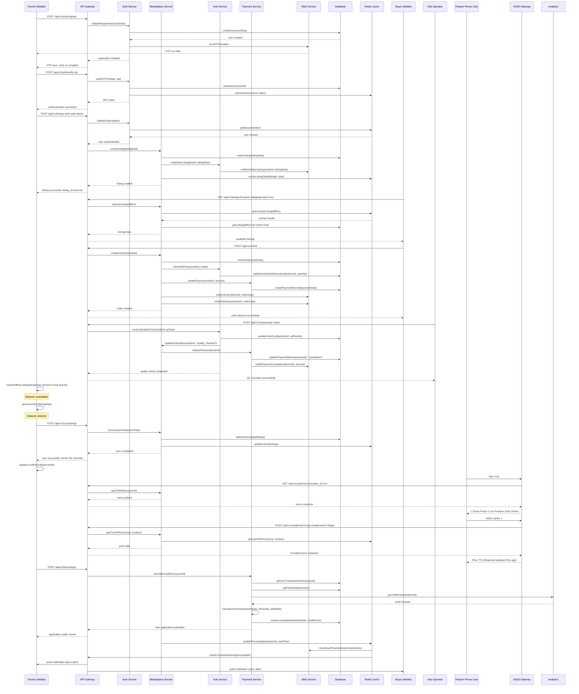

# Gram-Vikas: Unified Rural Economic Engine - System Design Document

## Implementation Approach

We will build a comprehensive rural economic platform using a microservices architecture with Node.js/Express backend, PostgreSQL for data persistence, Redis for caching and session management, and React Native for mobile applications. The system will support both smartphone users through native apps and feature phone users through USSD/IVR/SMS interfaces.

**Key Technical Decisions:**
- **Microservices Architecture**: Enables independent scaling and deployment of different platform components
- **Offline-First Mobile Strategy**: Critical for rural connectivity challenges with local SQLite sync
- **Multi-Channel Access**: React Native apps, PWA, USSD, IVR, and SMS for universal accessibility
- **Event-Driven Architecture**: Using Redis pub/sub for real-time notifications and data synchronization
- **API-First Design**: RESTful APIs with GraphQL for complex queries and real-time subscriptions

**Open Source Framework Selection:**
- **Backend**: Node.js with Express.js framework for rapid development and extensive ecosystem
- **Database**: PostgreSQL for ACID compliance and complex queries with PostGIS for geospatial data
- **Cache/Queue**: Redis for caching, session management, and message queuing
- **Mobile**: React Native for cross-platform development with shared codebase
- **Web**: Next.js with TypeScript and Tailwind CSS for responsive web interfaces
- **Authentication**: Passport.js with JWT tokens for secure, stateless authentication
- **Payments**: Razorpay SDK for UPI and payment gateway integration
- **SMS/USSD**: Africa's Talking or similar provider APIs for feature phone support
- **File Storage**: AWS S3 compatible storage (MinIO for self-hosted option)
- **Monitoring**: Prometheus + Grafana for metrics and monitoring

## Data Structures and Interfaces

```mermaid
classDiagram
    class User {
        +String user_id PK
        +String mobile_number UK
        +String name
        +String email
        +String role [farmer, hub_operator, buyer, admin, skg_leader]
        +String language_preference
        +String kyc_status
        +JSON kyc_documents
        +String village_id FK
        +DateTime created_at
        +DateTime updated_at
        +Boolean is_active
        +register(userData: UserData) User
        +authenticate(mobile: String, otp: String) AuthToken
        +updateProfile(profileData: ProfileData) User
        +getTransactionHistory() Transaction[]
    }

    class Village {
        +String village_id PK
        +String name
        +String state
        +String district
        +String block
        +String pincode
        +Point coordinates
        +JSON demographics
        +String hub_id FK
        +DateTime created_at
        +Boolean is_active
        +registerVillage(villageData: VillageData) Village
        +getVillageStats() VillageStats
        +getNearbyHubs() Hub[]
    }

    class Farm {
        +String farm_id PK
        +String farmer_id FK
        +String village_id FK
        +Decimal acreage
        +JSON soil_type
        +JSON crops_grown
        +Point location
        +String certification_type
        +DateTime created_at
        +addCrop(cropData: CropData) Crop
        +getCropCalendar() CropCalendar
        +getYieldHistory() YieldRecord[]
    }

    class Product {
        +String product_id PK
        +String sku_code UK
        +String name
        +String category [cereals, vegetables, fruits, pulses]
        +String unit [kg, quintal, tonnes]
        +JSON quality_parameters
        +JSON seasonal_info
        +Boolean is_active
        +DateTime created_at
        +getMarketPrice(location: String) Price
        +getQualityGrades() QualityGrade[]
    }

    class Listing {
        +String listing_id PK
        +String farmer_id FK
        +String product_id FK
        +String farm_id FK
        +Decimal quantity
        +String quality_grade
        +Decimal asking_price
        +DateTime harvest_date
        +DateTime expiry_date
        +String status [active, sold, expired, cancelled]
        +JSON photos
        +String hub_id FK
        +DateTime created_at
        +createListing(listingData: ListingData) Listing
        +updateStatus(status: String) Boolean
        +getBids() Bid[]
    }

    class Order {
        +String order_id PK
        +String buyer_id FK
        +String listing_id FK
        +String farmer_id FK
        +Decimal quantity
        +Decimal agreed_price
        +String status [pending, confirmed, picked_up, delivered, completed, cancelled]
        +DateTime pickup_date
        +String hub_id FK
        +JSON quality_check_results
        +String payment_id FK
        +DateTime created_at
        +DateTime updated_at
        +createOrder(orderData: OrderData) Order
        +updateStatus(status: String, notes: String) Boolean
        +calculateTotal() Decimal
        +processPayment() Payment
    }

    class Hub {
        +String hub_id PK
        +String name
        +String village_id FK
        +String operator_id FK
        +Point location
        +JSON facilities [weighbridge, storage, processing]
        +Decimal capacity_tonnes
        +JSON operating_hours
        +String status [active, inactive, maintenance]
        +DateTime created_at
        +manageInventory() Inventory[]
        +schedulePickup(orderId: String, date: DateTime) Pickup
        +conductQualityCheck(orderId: String) QualityReport
    }

    class Inventory {
        +String inventory_id PK
        +String hub_id FK
        +String product_id FK
        +String batch_id
        +Decimal quantity_available
        +String quality_grade
        +DateTime received_date
        +DateTime expiry_date
        +String storage_location
        +String status [available, reserved, sold, expired]
        +updateQuantity(quantity: Decimal) Boolean
        +reserveStock(orderId: String, quantity: Decimal) Boolean
        +releaseStock(orderId: String) Boolean
    }

    class Payment {
        +String payment_id PK
        +String order_id FK
        +String payer_id FK
        +String payee_id FK
        +Decimal amount
        +String payment_method [upi, bank_transfer, cash]
        +String gateway_transaction_id
        +String status [pending, completed, failed, refunded]
        +DateTime initiated_at
        +DateTime completed_at
        +JSON gateway_response
        +initiatePayment(paymentData: PaymentData) Payment
        +processCallback(callbackData: CallbackData) Boolean
        +refundPayment(reason: String) Refund
    }

    class Loan {
        +String loan_id PK
        +String borrower_id FK
        +String loan_type [crop_loan, input_finance, equipment_loan]
        +Decimal principal_amount
        +Decimal interest_rate
        +Integer tenure_months
        +Decimal outstanding_amount
        +String status [applied, approved, disbursed, active, closed, defaulted]
        +DateTime applied_at
        +DateTime disbursed_at
        +DateTime due_date
        +JSON collateral_details
        +applyLoan(loanData: LoanData) Loan
        +approveLoan(approvalData: ApprovalData) Boolean
        +disburseLoan() Boolean
        +recordRepayment(amount: Decimal) Repayment
    }

    class Logistics {
        +String logistics_id PK
        +String order_id FK
        +String vehicle_id FK
        +String driver_id FK
        +String route_id FK
        +DateTime scheduled_pickup
        +DateTime actual_pickup
        +DateTime estimated_delivery
        +DateTime actual_delivery
        +String status [scheduled, in_transit, delivered, cancelled]
        +Point current_location
        +schedulePickup(orderIds: String[], vehicleId: String) Route
        +optimizeRoute(pickupPoints: Point[]) OptimizedRoute
        +trackShipment() LocationUpdate[]
    }

    class Analytics {
        +String analytics_id PK
        +String entity_type [user, village, hub, product]
        +String entity_id
        +String metric_name
        +JSON metric_value
        +DateTime recorded_at
        +String aggregation_period [daily, weekly, monthly]
        +recordMetric(metricData: MetricData) Boolean
        +generateReport(reportType: String, filters: JSON) Report
        +getPriceAnalytics(productId: String, period: String) PriceAnalytics
    }

    class Notification {
        +String notification_id PK
        +String user_id FK
        +String type [sms, push, ussd, email]
        +String title
        +String message
        +JSON data
        +String status [pending, sent, delivered, failed]
        +DateTime scheduled_at
        +DateTime sent_at
        +sendNotification(notificationData: NotificationData) Boolean
        +scheduleNotification(scheduleData: ScheduleData) Boolean
        +getDeliveryStatus() DeliveryStatus
    }

    %% Relationships
    User ||--o{ Farm : owns
    User ||--o{ Listing : creates
    User ||--o{ Order : places
    User ||--o{ Loan : applies
    Village ||--|| Hub : has
    Village ||--o{ User : contains
    Farm ||--o{ Listing : produces
    Product ||--o{ Listing : listed_as
    Listing ||--o{ Order : generates
    Order ||--|| Payment : requires
    Order ||--|| Logistics : scheduled_for
    Hub ||--o{ Inventory : manages
    Hub ||--o{ Order : processes
    Product ||--o{ Inventory : stored_as
    User ||--o{ Payment : makes
    User ||--o{ Notification : receives
```

## Program Call Flow



## Anything UNCLEAR

1. **Regulatory Compliance Specifics**: The exact agricultural marketing regulations vary by state in India. We need clarification on:
   - Interstate commerce requirements and e-NAM integration
   - GST compliance for agricultural transactions
   - APMC bypass regulations and required licenses
   - Data localization requirements for farmer data

2. **Payment Gateway Strategy**: Multiple options need evaluation:
   - Primary UPI integration (PhonePe, Google Pay, Paytm)
   - Backup payment methods for areas with poor digital payment adoption
   - Cash-on-delivery handling and reconciliation processes
   - International payment support for export transactions

3. **Quality Standardization**: Need to define:
   - Proprietary vs industry-standard quality grading systems
   - Training and certification process for hub operators
   - Dispute resolution mechanism for quality disagreements
   - Integration with existing agricultural quality standards (AGMARK, etc.)

4. **Data Monetization vs Privacy**: Balance between:
   - Aggregated market intelligence as revenue source
   - Individual farmer data privacy and consent management
   - Third-party data sharing agreements and compliance
   - Farmer data ownership and portability rights

5. **Logistics Partnership Model**: Clarification needed on:
   - Build vs buy decision for logistics capabilities
   - Integration requirements with existing logistics providers
   - Cold chain infrastructure investment and partnerships
   - Last-mile delivery optimization in rural areas

6. **Credit Risk Management**: External data integration requirements:
   - Weather data APIs and satellite imagery for crop monitoring
   - Government database integration (land records, subsidies)
   - Credit bureau integration for formal credit history
   - Alternative data sources for credit scoring (mobile usage, social connections)

7. **Scalability Thresholds**: Technical architecture decisions:
   - Microservices migration timeline and triggers
   - Database sharding strategy for transaction-heavy workloads
   - CDN and edge computing requirements for rural areas
   - Auto-scaling policies and cost optimization strategies

8. **Offline Capability Scope**: Define offline functionality boundaries:
   - Critical features that must work offline (listing creation, order viewing)
   - Conflict resolution strategies for concurrent offline edits
   - Sync frequency and data prioritization during limited connectivity
   - Local storage limits and data cleanup policies
